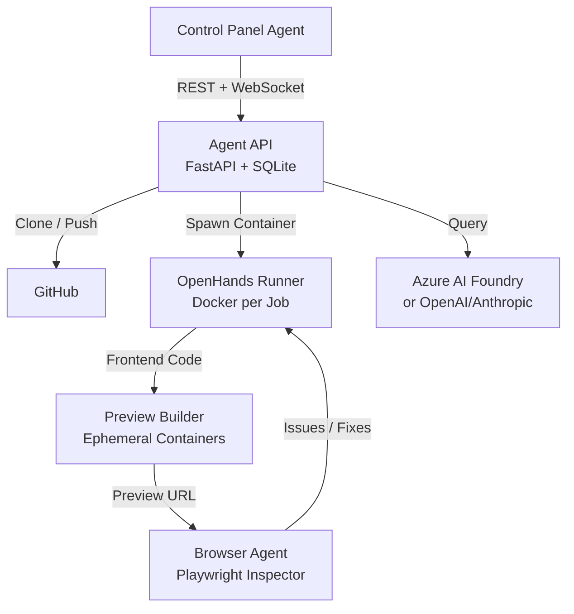
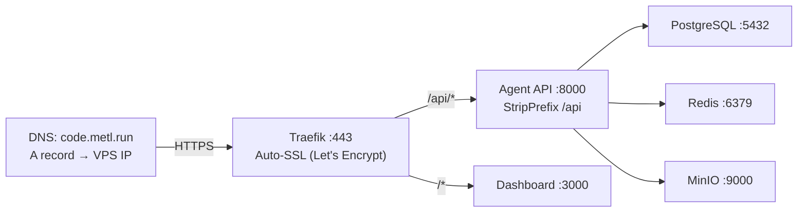

# Metl Autonomous Cloud Coding Agent

A fully autonomous cloud-based coding agent that orchestrates [OpenHands](https://github.com/All-Hands-AI/OpenHands) inside Docker containers to build complete applications from a prompt — entirely agent-to-agent, zero human intervention.

## Architecture



## Quick Start

### Local Development
```bash
# Start infrastructure (no DB needed - SQLite auto-creates)
./scripts/local-dev.sh

# Then in separate terminals:
# Terminal 1: Agent API
cd apps/agent-api
pip install -e ".[dev]"
uvicorn src.main:app --reload --port 8000

# Terminal 2: Dashboard
pnpm dev
# Opens http://localhost:3000
```

### Production Deployment (VPS)
```bash
# 1. Init VPS
ssh root@vps-ip "bash -s" < scripts/init-server.sh

# 2. Clone and configure
git clone https://github.com/your-org/metl-coding-agent.git
cd metl-coding-agent
cp .env.example .env
nano .env  # Set AZURE_AI_API_KEY and AZURE_AI_BASE_URL

# 3. Deploy
docker compose up -d --build

# 4. Verify
curl https://code.metl.run/api/health
```

## Project Structure

```
metl-coding-agent/
├── apps/
│   ├── dashboard/              # Next.js 16.x dashboard
│   │   ├── app/                # App router pages
│   │   ├── components/         # React components
│   │   └── lib/                # Utilities, API client
│   └── agent-api/              # FastAPI backend
│       ├── src/
│       │   ├── api/            # REST + WebSocket routes
│       │   ├── core/           # Orchestrator, config, DB
│       │   ├── models/         # Pydantic + SQLAlchemy
│       │   └── services/       # GitHub, OpenHands, Preview, Browser
│       └── tests/              # Unit + integration tests
├── packages/
│   ├── shared/                 # Shared TS types + Zod schemas
│   ├── browser-agent/          # Playwright browser inspector
│   └── cursor-sdk-plugin/      # Optional Cursor SDK adapter
├── services/
│   ├── openhands-runner/       # OpenHands Docker runner
│   └── preview-builder/        # Frontend preview builder
├── scripts/
│   ├── init-server.sh          # One-time VPS setup
│   ├── deploy.sh               # Git pull + rebuild + migrate
│   └── local-dev.sh            # Local development startup
├── docker-compose.yml          # Production: Traefik + all services
├── traefik.yml                 # Traefik static config (SSL, providers)
├── traefik-dynamic.yml         # Traefik dynamic config (routing rules)
├── .env.example                # Production environment template
└── README.md
```

## Control Panel API Contract

### Incoming: Create Job
```http
POST /v1/jobs
Content-Type: application/json
```
```json
{
  "github_url": "https://github.com/user/repo",
  "plan_md_url": "https://.../plan.md",
  "prompt": "Build a SaaS dashboard with auth and billing",
  "options": {
    "enable_v0": false,
    "enable_cursor_sdk": false,
    "llm_provider": "anthropic",
    "llm_model": "claude-sonnet-4-20250514"
  }
}
```

### Outgoing: Resource Request
```http
POST {control_panel_webhook}/resource-request
```
```json
{
  "job_id": "uuid",
  "requested": [
    {"type": "postgresql", "tier": "small"},
    {"type": "s3_compatible", "region": "us-east-1"}
  ]
}
```

### Outgoing: Completion Report
```http
POST {control_panel_webhook}/completion
```
```json
{
  "job_id": "uuid",
  "status": "success",
  "summary": "App built successfully",
  "changes": [{"type": "created", "file": "src/App.tsx"}],
  "preview_url": "https://preview.example.com",
  "screenshots": [],
  "artifacts_s3_prefix": "s3://metl-artifacts/job-uuid/",
  "duration_seconds": 120.5
}
```

## Orchestration Flow

1. **Receive Job** - Control panel sends job with GitHub URL + prompt
2. **Clone Repo** - Clone target repository into isolated workspace
3. **Generate Plan** - Parse provided plan or auto-generate detailed implementation plan using Vercel AI SDK
4. **Run OpenHands** - Spawn OpenHands Docker container with the plan as task
5. **Request Resources** - If code needs DB/storage/etc., request from control panel
6. **Build Preview** - Detect frontend, build in ephemeral container, serve via nginx
7. **Browser Inspection** - Playwright opens preview, captures screenshots, detects errors
8. **Auto-Fix Loop** - Browser agent reports issues back to OpenHands for automatic fixes
9. **Generate Report** - Create detailed completion report with changes, screenshots, metrics
10. **Notify Control Panel** - POST completion report back to control panel

## Configuration

### Azure AI Foundry (Primary LLM)

Set these in `.env`:

```env
AZURE_AI_API_KEY=your-azure-foundry-api-key
AZURE_AI_BASE_URL=https://your-resource.cognitiveservices.azure.com/openai/deployments/your-deployment
AZURE_AI_MODEL=gpt-4o
```

Azure AI Foundry exposes an OpenAI-compatible endpoint. Requests use the `api-key` header instead of `Authorization: Bearer`.

### Other LLM Providers

```env
LLM_OPENAI_API_KEY=sk-...
LLM_ANTHROPIC_API_KEY=sk-ant-...
LLM_GOOGLE_API_KEY=...
LLM_MISTRAL_API_KEY=...
```

### Optional Features

| Feature | Flag | Description |
|---------|------|-------------|
| v0 Integration | `enable_v0` | Generate UI components via v0.dev (optional, skips if not configured) |
| Cursor SDK | `enable_cursor_sdk` | Use Cursor Agent SDK for orchestration (optional, removable) |

### v0 Integration (Optional)

v0.dev is optional. If `V0_API_URL` is empty, the endpoint returns a "not configured" message instead of an error.

## Architecture Decisions

- **SQLite for MVP**: Zero-config database, auto-creates on first startup. No PostgreSQL needed.
- **Azure AI Foundry**: Custom OpenAI-compatible endpoint with `api-key` authentication.
- **Local screenshot storage**: Screenshots saved to disk at `ARTIFACTS_DIR`. No MinIO/S3 needed.
- **In-memory log streaming**: WebSocket log broadcast uses in-memory dicts. No Redis needed.
- **OpenHands**: Python-native autonomous agent with browser, bash, and code editing.
- **Docker per job**: Complete isolation between jobs.
- **Ephemeral previews**: Previews auto-expire after 2 hours.

## License

MIT

---

## Production Deployment (code.metl.run)

### VPS Requirements

| Resource | Minimum | Recommended |
|----------|---------|-------------|
| CPU | 2 vCPU | 4 vCPU |
| RAM | 4 GB | 8 GB |
| Storage | 40 GB SSD | 80 GB SSD |
| OS | Ubuntu 22.04 LTS | Ubuntu 24.04 LTS |
| Bandwidth | 1 TB/month | Unlimited |

### Architecture (Production)



### DNS Setup

Set an **A record** on your domain registrar:
- `code.metl.run` → `YOUR_VPS_IP`

Traefik will auto-obtain Let's Encrypt certificates once the DNS propagates.

### Firewall Rules

```bash
ufw allow 22/tcp        # SSH
ufw allow 80/tcp        # HTTP (Traefik)
ufw allow 443/tcp       # HTTPS (Traefik)
ufw allow 9000:9100/tcp # Preview containers
ufw enable
```

### Complete Deployment Sequence

#### Step 1: Initialize the VPS

```bash
ssh root@your-vps-ip "bash -s" < scripts/init-server.sh
```

This installs Docker, Docker Compose, Git, and creates `acme.json` for Traefik.

#### Step 2: Clone and configure

```bash
ssh user@your-vps-ip
git clone https://github.com/your-org/metl-coding-agent.git
cd metl-coding-agent
cp .env.example .env
nano .env  # Set AZURE_AI_API_KEY, AZURE_AI_BASE_URL, AZURE_AI_MODEL
```

#### Step 3: Build and start

```bash
docker compose up -d --build
```

SQLite auto-creates on first startup. No database migration needed.

#### Step 4: Verify

```bash
curl https://code.metl.run/api/health
# {"status":"ok","version":"0.1.0"}
```

### Traefik Routing Rules

| Path | Service | Notes |
|------|---------|-------|
| `/api/*` | Agent API (port 8000) | Strips `/api` prefix before forwarding |
| `/api/*` + `Upgrade: websocket` | Agent API | WebSocket support for live logs |
| `/*` | Dashboard (port 3000) | Next.js app serving all non-API routes |
| `/traefik` | Traefik Dashboard | Optional; for debugging routing |

### Port Strategy

| Service | Production | Notes |
|---------|-----------|-------|
| Traefik | 80, 443 | Only ports exposed to internet |
| Dashboard | Internal only | Accessed via Traefik |
| Agent API | Internal only | Accessed via Traefik |
| PostgreSQL | Internal only | Container network only |
| Redis | Internal only | Container network only |
| MinIO | Internal only | Container network only |
| Preview Containers | 9000-9100 | Host ports for ephemeral preview; use VPS firewall to limit access |

### Day-to-Day Operations

```bash
# Deploy new code changes
./scripts/deploy.sh

# View logs
docker compose logs -f agent-api     # API logs
docker compose logs -f dashboard     # Dashboard logs
docker compose logs -f traefik       # SSL/routing logs

# Restart a specific service
docker compose restart agent-api

# Stop everything
docker compose down

# Stop and remove all data (DANGER)
docker compose down -v
```

### Security Notes

1. All credentials are in `.env` (gitignored); never committed to git
2. CORS allows only `https://code.metl.run`
3. Docker socket is exposed to the API container (required for spawning OpenHands/preview containers)
4. Traefik auto-renews SSL certificates; no manual intervention needed
5. Preview port range (9000-9100) is open on firewall; restrict access if not needed